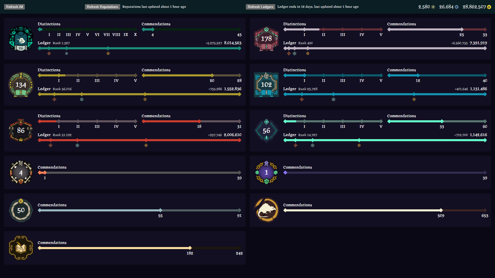

# Sea of Thieves Dashboard

Unofficial Sea of Thieves Dashboard Chrome extension.



## First Time Download and Installation

1. Download the latest extension in the [releases](https://github.com/GeneralQuarter/sot-dashboard/releases/latest) page
2. Extract the zip into a folder
3. Load the folder as an unpacked extension in Chrome

## Updating

1. Download the latest extension in the [releases](https://github.com/GeneralQuarter/sot-dashboard/releases/latest) page
2. Extract into the same folder
3. Refresh the extension in Chrome

## Credits

All icons/images are loaded on the fly from [Sea of Thieves's website](https://www.seaofthieves.com/) or the [Sea of Thieves Wiki](https://seaofthieves.wiki.gg/)

Some data (specified in code with comments) was taken from the [Sea of Thieves Wiki](https://seaofthieves.wiki.gg/)

Using [PragRoman font](https://www.dafont.com/pragroman.font) by Manfred Klein

## Features

- View progress towards trading companies, guilds (including ledger progression and times completed)
- View, filter and search commendations

## Development

### Install

- Requires Node 20+
- Google Chrome with your microsoft account connected to [https://www.seaofthieves.com/](https://www.seaofthieves.com/)

1. Install dependencies

```sh
npm run install
```

2. Environment variables

Create a `.env` file at the root of the project containing the following environments variables

```sh
# Rare Access Token - used by vite dev server proxy
VITE_RAT=
# API base URL - used by the extension, empty for development as vite proxies API requests
VITE_API_BASE_URL=
# Change as needed - used by rat.mjs (puppeteer) to fetch the Rare Access Token
CHROME_EXECUTABLE_PATH=C:\Program Files (x86)\Google\Chrome\Application\chrome.exe
# Change as needed - used by rat.mjs (puppeteer) to fetch the Rare Access Token
CHROME_USER_DATA_DIR=C:\Users\<User>\AppData\Local\Google\Chrome\User Data
```

3. Fetch the Rare Access Token for local development

> [!IMPORTANT]
> You have to close Chrome before running the next command, puppeteer cannot open Chrome with a profile that's already in use

```sh
npm run rat
```

The rare access token (`rat`) is needed to access the Sea of Thieves API, it is stored in a cookie on [https://www.seaofthieves.com/](https://www.seaofthieves.com/).
This command will read and copy the `rat` token from Chrome to the `.env` file.

> [!TIP]
> Rerun this command if you're getting `403`'s from the API

4. Run the dev server

```sh
npm run dev
```

### Build the extension

1. Install dependencies

```sh
npm run install
```

2. Environment variables

Create a `.env.production` file at the root of the project containing the following environments variables

```sh
VITE_API_BASE_URL=https://www.seaofthieves.com
```

3. Build the extension

```sh
npm run build
```

4. Load extension

Load the `extension` folder as an unpacked extension in Chrome or refresh the extension

### Package extension

1. Go through the build process up to step 3
2. Package the extension

```sh
npm run package
```

A `build/sot-dashboard-<version>.zip` should be created
